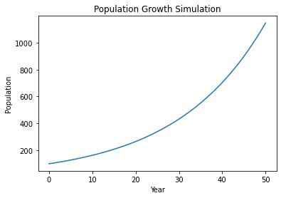
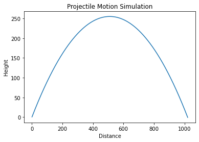

## Objectives
1. Understand how computers can be used to represent real-world phenomena or outcomes
2. Compare simulations with real-world contexts.
3. Implement code to mimic real world situations, problems, or phenomena.

## What are simulations by College Board definition?

- Simulations are abstractions that mimic more complex objects or phenomena from the real world
    - Purposes include drawing inferences without the constraints of the real world
- Simulations use varying sets of values to reflect the changing state of a real phenomenon
- Often, when developing a simulation, it is necessary to remove specific details or simplify aspects
    - Simulations can often contain bias based on which details or real-world elements were included/excluded
- Simulations allow the formulation of hypothesis under consideration
- Variability and randomness of the world is considered using random number generators
- Examples: rolling dice, spinners, molecular models, analyze chemicals/reactions...


## Analyzing an Example: Air-Traffic Simulator
- Say we want to find out what the optimal number of aircrafts that can be in the air in one area is.
- A simulation allows us to explore this question without real world contraints of money, time, safety
    - Unfortunately we can't just fly 67 planes all at once and see what happens
- Since the simulation won't be able to take all variables into control, it may have a bias towards one answer
- Will not always have the same result

## Functions we often need (python)


```python
import random # a module that defines a series of functions for generating or manipulating random integers
random.choice() #returns a randomly selected element from the specified sequence
random.choice(mylist) # returns random value from list
random.randint(0,10) #randomly selects an integer from given range; range in this case is from 0 to 10
random.random() #will generate a random float between 0.0 to 1.
```

## Functions we often need (js)


```python
Math.random(); // returns a random number
Math.floor(Math.random() * 10); // Returns a random integer from 0 to 9:
```

## College Board Question 1

Question: The following code simulates the feeding of 4 fish in an aquarium while the owner is on a 5-day trip:

    numFish ← 4

    foodPerDay ← 20

    foodLeft ← 160

    daysStarving ← 0

        REPEAT 5 TIMES {

        foodConsumed ← numFish * foodPerDay

        foodLeft ← foodLeft - foodConsumed

        IF (foodLeft < 0) {

        daysStarving ← daysStarving + 1

        }
}

- This simulation simplifies a real-world scenario into something that can be modeled in code and executed on a computer.
- Summarize how the code works:
<br> This code works by first setting the variables of the number of fish, the food each fish needs, and the total food at the beginning. Then, it simulates all 5 days, by calculating how much food each fish needs per day and subtrating that by the ammount of food left. If there is negative food, it increase the days that the fish has been starving. 

## Examples

### Card Flip


```python
import random

cards = ["Ace", "2", "3", "4", "5", "6", "7", "8", "9", "10", "Jack", "Queen", "King"] 
suits = ["Diamonds", "Hearts", "Spades", "Clubs"]

print(random.choice(cards) + " of " + random.choice(suits))
```

    6 of Spades


### Coin Flip


```python
import random

def coinflip():         #def function 
    randomflip = random.randint(0, 1) #picks either 0 or 1 randomly 
    if randomflip == 0: #assigning 0 to be heads--> if 0 is chosen then it will print, "Heads"
        print("Heads")
    elif randomflip == 1: #assigning 1 to be tails--> if 1 is chosen then it will print, "Tails"
        print("Tails")

def weightedCoinFlip():
    randomflip = random.randint(0, 2) #picks either 0, 1 or 2 randomly 
    if randomflip == 0: #if 0 is chosen then it will print, "Heads"
        print("Heads")
    else: # if 1 or 2 is chosen then it will print, "Tails"
        print("Tails")


#Tossing the coin 5 times:
print("unweighted:")
coinflip()
coinflip()
coinflip()
coinflip()
coinflip()
print("weighted:")
weightedCoinFlip()
weightedCoinFlip()
weightedCoinFlip()
weightedCoinFlip()
weightedCoinFlip()

```

    unweighted:
    Tails
    Tails
    Tails
    Tails
    Tails
    weighted:
    Tails
    Heads
    Heads
    Tails
    Heads


Your turn: Change the code to make it simulate the flipping of a weighted coin.

## Adding images (in Python)

- Add a heads and tails images into your images directory with the correct names and run the code below


```python
import random

# importing Image class from PIL package
from PIL import Image
 
# creating a object
im = Image.open(r"images/heads.png")
image = Image.open(r"images/tails.png")

i=random.randint(0,1)

if i == 1:
    print("heads")
    display(im)

else:
    print("tails")
    display(image)
```

    heads


    

    


In order to display an image in python, we can use the PIL package we previously learned about.

### Spin the Wheel


```python
import random

print("Spin the wheel!")
print("----------------------------------")

n = 300
blue = 0
red = 0
 
for i in range(n):
    spin = random.randint(1,2)
    if spin == 1: # head
        blue = blue + 1
    else:         # tail
        red = red + 1
 
print('Number of blue:', blue)
print('Number of red:', red)
print()

if (red > blue):
    print("You got more Red than Blue")
    display(Image.open(r"images/red.png"))
else:
    print("You got more Blue than Red")
    display(Image.open(r"images/blue.png"))


```

    Spin the wheel!
    ----------------------------------
    Number of blue: 140
    Number of red: 160
    
    You got more Red than Blue


    

    


Your turn: Add a visual to the simulation!

## Population Growth and Plots


```python
import random

totalPopulation = 50 
growthFactor = 1.00005
dayCount = 0 #Every 2 months the population is reported

while totalPopulation < 1000000:
    totalPopulation *= growthFactor
    #Every 56th day, population is reported
    dayCount += 1
    if dayCount % 56 == 0: 
        print(totalPopulation)
print(dayCount)
```

    50.14019267336515
    50.28077842644361
    924471.390705649
    927063.4730199015
    929662.8231531383
    932269.4614832586
    934883.408445299
    937504.6845315925
    940133.3102919292
    942769.306333718
    945412.6933221479
    948063.4919803509
    950721.7230895628
    953387.4074892879
    956060.5660774591
    958741.2198106066
    961429.3897040186
    964125.096831907
    966828.3623275728
    969539.2073835713
    972257.6532518797
    974983.721244062
    977717.4327314354
    980458.8091452414
    983207.8719768105
    985964.6427777322
    988729.1431600227
    991501.3947962954
    994281.4194199304
    997069.2388252458
    999864.8748676664
    198075


Here we initialize the total population to be 50, then set the growth factor as 1.00005 (.005 percent change). It will print the population every 56th day until it reaches one million. It multiplies the current population by the growth factor in each iteration, and increments the day count. When the day count reaches 56, it prints the current population and resets the day count to 0.

Note! This simulation assumes that the growth factor remains constant as time progresses, which may not be a realistic assumption in real-world scenarios.


```python
import matplotlib.pyplot as plt

# Define the initial population and growth rate
population = 100
growth_rate = 0.05

# Define the number of years to simulate
num_years = 50

# Create lists to store the population and year values
populations = [population]
years = [0]

# Simulate population growth for the specified number of years
for year in range(1, num_years+1):
    # Calculate the new population size
    new_population = population + (growth_rate * population)
    # Update the population and year lists
    populations.append(new_population)
    years.append(year)
    # Set the new population as the current population for the next iteration
    population = new_population
    
# Plot the population growth over time
plt.plot(years, populations)
plt.xlabel('Year')
plt.ylabel('Population')
plt.title('Population Growth Simulation')
plt.show()
```


    

    


If we create quantative data, we can plot it using the [Matplotlib library](https://matplotlib.org/).

## Example on how simplification can cause bias


```python
import random

beak =  ["small-beak", "long-beak", "medium-beak"],
wing = ["small-wings", "large-wings", "medium-wings"],
height = ["short", "tall","medium"]


naturaldisaster = ["flood", "drought", "fire", "hurricane", "dustbowl"]


print("When a" , random.choice(naturaldisaster) , "hit",  random.choice(height), "birds died") 
```

    When a dustbowl hit medium birds died


How does this simulation have bias?

This simulation has bias because the disastor is random and so has no cause/reason, and the height has no effect on whether the birds died. 

# JS examples

[Dice Roll](https://shruthim0.github.io/canada/diceroll/)
[Binary Coin Flip](https://shruthim0.github.io/canada/2023/04/13/Coin-Flip.html)
[Card Pull](https://shruthim0.github.io/canada/2023/04/16/Card-Pull.html)

## Hacks

- Answer all questions and prompts in the notes (0.2)
- Create a simulation
    1. Create a simulation that uses iteration and some form of data collection (list, dictionary...) (0.4)
        - try creating quantative data and using the Matplotlib library to display said data 
        - Comment and describe function of each parts
        - How does your simulation help solve/mimic a real world problem?
        - Is there any bias in your simulation? Meaning, are there any discrepancies between your program and the real event?
- Answer these [simulation questions](https://shruthim0.github.io/canada/2023/04/03/simulationsplanning2.html) (0.3)
- Bonus: take a real world event and make a pseudocode representation or pseudocode on a flowchart of how you would make a simulation for it (up to +0.1 bonus)


```python
import matplotlib.pyplot as plt
import math

def angleToRadian(angle): # Function to convert an angle to radians
    return math.pi * angle/180

initialVelocity = 100 # Variable to set the initial velocity
angle = 45
Vix = initialVelocity * math.sin(angleToRadian(angle)) # Finds the horizontal component of velocity
Viy = initialVelocity * math.cos(angleToRadian(angle)) # Finds the vertical component of velocity

# Defining variables
t = 0
x = 0
y = 0
Xs = []
Ys = []

# This is the main simulation loop
while Viy * t - 0.5 * 9.8 * (t**2) >= 0: # Checks if the y value is greater than 0 to continue the simulation.
    t += 0.01 # increments time by .01 seconds
    Xs.append(Vix * t) # Adds the X position to the list of x values
    Ys.append(Viy * t - 0.5 * 9.8 * (t**2)) # Adds the y position to the list of 


# Creates the graph
plt.plot(Xs, Ys)
plt.xlabel('Distance')
plt.ylabel('Height')
plt.title('Projectile Motion Simulation')
plt.show()

# My simulation works by calculating the x and y position of a projectile in free fall using the kinematic equations. 
# There is bias in my simulation or at least innacuracies. My simulation assumes extrenious forces like air resistence are negligable, which they may not be. 
# It also sets gravitational acceletation to 9.8 which is a rounded value. 

```


    

    


Simulation Questions:
1. A, B
2. A
3. A
4. D
5. B, C
6. C

Corrections:
I got 5 wrong, instead of C the answer is D. I don't understand why it's wrong. I think the question is bad. 
